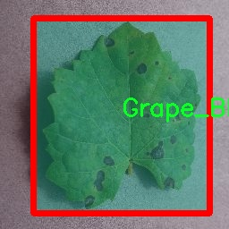

### 1.背景意义

研究背景与意义

植物病害的早期检测与诊断对于农业生产的可持续发展至关重要。随着全球气候变化和农业生产方式的转变，植物病害的种类和传播速度日益增加，给农作物的产量和质量带来了严重威胁。因此，开发高效、准确的植物病害检测系统显得尤为重要。传统的人工检测方法不仅耗时耗力，而且容易受到主观因素的影响，难以保证检测结果的准确性和一致性。近年来，计算机视觉和深度学习技术的快速发展为植物病害的自动检测提供了新的解决方案。

本研究基于改进的YOLOv11模型，旨在构建一个高效的植物病害检测系统。该系统将利用一个包含4100张图像的多类别数据集，涵盖10种不同的植物病害和健康状态，包括苹果黑腐病、樱桃粉霉病、葡萄黑腐病等。这些类别的选择不仅反映了当前农业生产中常见的病害类型，也为模型的训练提供了丰富的样本，增强了其泛化能力。通过对这些图像进行实例分割处理，系统能够更精确地识别和定位病害区域，从而为农民提供及时的预警和指导。

此外，基于YOLOv11的改进算法将进一步提升检测的速度和准确性，使得该系统能够在实际应用中实现实时监测。这一研究不仅具有重要的理论意义，也为农业生产实践提供了切实可行的技术支持。通过有效的病害检测，农民可以更好地管理作物，减少化学药剂的使用，从而实现生态农业的目标，促进农业的可持续发展。

### 2.视频效果

[2.1 视频效果](https://www.bilibili.com/video/BV1gikTYDEsN/)

### 3.图片效果


##### [项目涉及的源码数据来源链接](https://kdocs.cn/l/cszuIiCKVNis)**

注意：本项目提供训练的数据集和训练教程,由于版本持续更新,暂不提供权重文件（best.pt）,请按照6.训练教程进行训练后实现上图演示的效果。

### 4.数据集信息

##### 4.1 本项目数据集类别数＆类别名

nc: 10
names: ['Apple_black_rot', 'Apple_healthy', 'Cedar_apple_rust', 'Cherry_Powdery_mildew', 'Cherry_healthy', 'Grape_Black_rot', 'Grape_healthy', 'Peach_Bacterial_spot', 'Peach_healthy', 'Potato_Early_blight']


该项目为【图像分割】数据集，请在【训练教程和Web端加载模型教程（第三步）】这一步的时候按照【图像分割】部分的教程来训练

##### 4.2 本项目数据集信息介绍

本项目数据集信息介绍

本项目所使用的数据集名为“plantVillagedeneme”，其主要目标是为改进YOLOv11的植物病害检测系统提供支持。该数据集包含了10个不同的类别，专注于多种植物病害的识别与分类。这些类别包括：苹果黑腐病（Apple_black_rot）、健康苹果（Apple_healthy）、雪松苹果锈病（Cedar_apple_rust）、樱桃粉霉病（Cherry_Powdery_mildew）、健康樱桃（Cherry_healthy）、葡萄黑腐病（Grape_Black_rot）、健康葡萄（Grape_healthy）、桃子细菌性斑点病（Peach_Bacterial_spot）、健康桃子（Peach_healthy）以及土豆早疫病（Potato_Early_blight）。 

数据集的多样性使其在植物病害检测领域具有重要的应用价值。每个类别均包含大量的样本图像，这些图像经过精心标注，确保在训练过程中能够有效地提升模型的识别能力。通过对不同植物及其病害的深入学习，YOLOv11模型能够在实际应用中实现高效、准确的病害检测，进而为农业生产提供科学依据和技术支持。

在数据集的构建过程中，研究团队注重图像的多样性和代表性，确保涵盖不同生长阶段、不同环境条件下的植物样本。这种全面的覆盖不仅提高了模型的泛化能力，也增强了其在实际应用中的可靠性。此外，数据集的设计考虑到了不同病害的表现特征，使得模型能够更好地识别和区分相似症状的不同病害，为农民和农业专家提供更为精准的诊断工具。

总之，“plantVillagedeneme”数据集为改进YOLOv11的植物病害检测系统奠定了坚实的基础，期待通过这一项目的实施，能够在植物保护和农业可持续发展方面发挥积极作用。





### 5.全套项目环境部署视频教程（零基础手把手教学）

[5.1 所需软件PyCharm和Anaconda安装教程（第一步）](https://www.bilibili.com/video/BV1BoC1YCEKi/?spm_id_from=333.999.0.0&vd_source=bc9aec86d164b67a7004b996143742dc)


[5.2 安装Python虚拟环境创建和依赖库安装视频教程（第二步）](https://www.bilibili.com/video/BV1ZoC1YCEBw?spm_id_from=333.788.videopod.sections&vd_source=bc9aec86d164b67a7004b996143742dc)

### 6.改进YOLOv11训练教程和Web_UI前端加载模型教程（零基础手把手教学）

[6.1 改进YOLOv11训练教程和Web_UI前端加载模型教程（第三步）](https://www.bilibili.com/video/BV1BoC1YCEhR?spm_id_from=333.788.videopod.sections&vd_source=bc9aec86d164b67a7004b996143742dc)


按照上面的训练视频教程链接加载项目提供的数据集，运行train.py即可开始训练



     Epoch   gpu_mem       box       obj       cls    labels  img_size
     1/200     20.8G   0.01576   0.01955  0.007536        22      1280: 100%|██████████| 849/849 [14:42<00:00,  1.04s/it]
               Class     Images     Labels          P          R     mAP@.5 mAP@.5:.95: 100%|██████████| 213/213 [01:14<00:00,  2.87it/s]
                 all       3395      17314      0.994      0.957      0.0957      0.0843

     Epoch   gpu_mem       box       obj       cls    labels  img_size
     2/200     20.8G   0.01578   0.01923  0.007006        22      1280: 100%|██████████| 849/849 [14:44<00:00,  1.04s/it]
               Class     Images     Labels          P          R     mAP@.5 mAP@.5:.95: 100%|██████████| 213/213 [01:12<00:00,  2.95it/s]
                 all       3395      17314      0.996      0.956      0.0957      0.0845

     Epoch   gpu_mem       box       obj       cls    labels  img_size
     3/200     20.8G   0.01561    0.0191  0.006895        27      1280: 100%|██████████| 849/849 [10:56<00:00,  1.29it/s]
               Class     Images     Labels          P          R     mAP@.5 mAP@.5:.95: 100%|███████   | 187/213 [00:52<00:00,  4.04it/s]
                 all       3395      17314      0.996      0.957      0.0957      0.0845


###### [项目数据集下载链接](https://kdocs.cn/l/cszuIiCKVNis)

### 7.原始YOLOv11算法讲解


###### YOLOv11改进方向

与YOLOv 10相比，YOLOv 11有了巨大的改进，包括但不限于：

  * 增强的模型结构：模型具有改进的模型结构，以获取图像处理并形成预测
  * GPU优化：这是现代ML模型的反映，GPU训练ML模型在速度和准确性上都更好。
  * 速度：YOLOv 11模型现在经过增强和GPU优化以用于训练。通过优化，这些模型比它们的前版本快得多。在速度上达到了25%的延迟减少！
  * 更少的参数：更少的参数允许更快的模型，但v11的准确性不受影响
  * 更具适应性：更多支持的任务YOLOv 11支持多种类型的任务、多种类型的对象和多种类型的图像。

###### YOLOv11功能介绍

Glenn Jocher和他的团队制作了一个令人敬畏的YOLOv 11迭代，并且在图像人工智能的各个方面都提供了YOLO。YOLOv 11有多种型号，包括：

  * 对象检测-在训练时检测图像中的对象
  * 图像分割-超越对象检测，分割出图像中的对象
  * 姿态检测-当用点和线训练时绘制一个人的姿势
  * 定向检测（OBB）：类似于对象检测，但包围盒可以旋转
  * 图像分类-在训练时对图像进行分类

使用Ultralytics Library，这些模型还可以进行优化，以：

  * 跟踪-可以跟踪对象的路径
  * 易于导出-库可以以不同的格式和目的导出
  * 多场景-您可以针对不同的对象和图像训练模型

此外，Ultralytics还推出了YOLOv 11的企业模型，该模型将于10月31日发布。这将与开源的YOLOv
11模型并行，但将拥有更大的专有Ultralytics数据集。YOLOv 11是“建立在过去的成功”的其他版本的之上。

###### YOLOv11模型介绍

YOLOv 11附带了边界框模型（无后缀），实例分割（-seg），姿态估计（-pose），定向边界框（-obb）和分类（-cls）。

这些也有不同的尺寸：纳米（n），小（s），中（m），大（l），超大（x）。


YOLOv11模型

###### YOLOv11与前版本对比

与YOLOv10和YOLOv8相比，YOLOv11在Ultralytics的任何帖子中都没有直接提到。所以我会收集所有的数据来比较它们。感谢Ultralytics：

**检测：**


YOLOv11检测统计


YOLOv10检测统计

其中，Nano的mAPval在v11上为39.5，v10上为38.5；Small为47.0 vs 46.3，Medium为51.5 vs
51.1，Large为53.4 vs 53.2，Extra Large为54.7vs
54.4。现在，这可能看起来像是一种增量增加，但小小数的增加可能会对ML模型产生很大影响。总体而言，YOLOv11以0.3
mAPval的优势追平或击败YOLOv10。

现在，我们必须看看速度。在延迟方面，Nano在v11上为1.55 , v10上为1.84，Small为2.46 v2.49，Medium为4.70
v4.74，Large为6.16 v7.28，Extra Large为11.31
v10.70。延迟越低越好。YOLOv11提供了一个非常低的延迟相比，除了特大做得相当差的前身。

总的来说，Nano模型是令人振奋的，速度更快，性能相当。Extra Large在性能上有很好的提升，但它的延迟非常糟糕。

**分割：**


YOLOV11 分割统计


YOLOV9 分割统计


YOLOV8 分割数据

总体而言，YOLOv 11上的分割模型在大型和超大型模型方面比上一代YOLOv 8和YOLOv 9做得更好。

YOLOv 9 Segmentation没有提供任何关于延迟的统计数据。比较YOLOv 11延迟和YOLOv 8延迟，发现YOLOv 11比YOLOv
8快得多。YOLOv 11将大量GPU集成到他们的模型中，因此期望他们的模型甚至比CPU测试的基准更快！

姿态估计：


YOLOV11姿态估计统计


YOLOV8姿态估计统计

YOLOv 11的mAP 50 -95统计量也逐渐优于先前的YOLOv 8（除大型外）。然而，在速度方面，YOLOv
11姿势可以最大限度地减少延迟。其中一些延迟指标是版本的1/4！通过对这些模型进行GPU训练优化，我可以看到指标比显示的要好得多。

**定向边界框：**


YOLOv11 OBB统计


YOLOv8 OBB统计

OBB统计数据在mAP
50上并不是很好，只有非常小的改进，在某种程度上小于检测中的微小改进。然而，从v8到v11的速度减半，这表明YOLOv11在速度上做了很多努力。

**最后，分类：**


YOLOv 11 CLS统计


YOLOv8 CLS统计

从v8到v11，准确性也有了微小的提高。然而，速度大幅上升，CPU速度更快的型号。


### 8.200+种全套改进YOLOV11创新点原理讲解

#### 8.1 200+种全套改进YOLOV11创新点原理讲解大全

由于篇幅限制，每个创新点的具体原理讲解就不全部展开，具体见下列网址中的改进模块对应项目的技术原理博客网址【Blog】（创新点均为模块化搭建，原理适配YOLOv5~YOLOv11等各种版本）

[改进模块技术原理博客【Blog】网址链接](https://gitee.com/qunmasj/good)


#### 8.2 精选部分改进YOLOV11创新点原理讲解

###### 这里节选部分改进创新点展开原理讲解(完整的改进原理见上图和[改进模块技术原理博客链接](https://gitee.com/qunmasj/good)【如果此小节的图加载失败可以通过CSDN或者Github搜索该博客的标题访问原始博客，原始博客图片显示正常】
### 深度学习基础
卷积神经网络通过使用具有共享参数的卷积运算显著降低了模型的计算开销和复杂性。在LeNet、AlexNet和VGG等经典网络的驱动下，卷积神经网络现在已经建立了一个完整的系统，并在深度学习领域形成了先进的卷积神经网络模型。

感受野注意力卷积RFCBAMConv的作者在仔细研究了卷积运算之后获得了灵感。对于分类、目标检测和语义分割任务，一方面，图像中不同位置的对象的形状、大小、颜色和分布是可变的。在卷积操作期间，卷积核在每个感受野中使用相同的参数来提取信息，而不考虑来自不同位置的差分信息。这限制了网络的性能，这已经在最近的许多工作中得到了证实。

另一方面，卷积运算没有考虑每个特征的重要性，这进一步影响了提取特征的有效性，并最终限制了模型的性能。此外，注意力机制允许模型专注于重要特征，这可以增强特征提取的优势和卷积神经网络捕获详细特征信息的能力。因此，注意力机制在深度学习中得到了广泛的应用，并成功地应用于各个领域。

通过研究卷积运算的内在缺陷和注意力机制的特点，作者认为现有的空间注意力机制从本质上解决了卷积运算的参数共享问题，但仍局限于对空间特征的认知。对于较大的卷积核，现有的空间注意力机制并没有完全解决共享参数的问题。此外，他们无法强调感受野中每个特征的重要性，例如现有的卷积块注意力模块（CBAM）和 Coordinate注意力（CA）。

因此，[参考该博客提出了一种新的感受野注意力机制（RFA）](https://qunmasj.com)，它完全解决了卷积核共享参数的问题，并充分考虑了感受野中每个特征的重要性。通过RFA设计的卷积运算（RFAConv）是一种新的卷积运算，可以取代现有神经网络中的标准卷积运算。RFAConv通过添加一些参数和计算开销来提高网络性能。

大量关于Imagnet-1k、MS COCO和VOC的实验已经证明了RFAConv的有效性。作为一种由注意力构建的新型卷积运算，它超过了由CAM、CBAM和CA构建的卷积运算（CAMConv、CBAMConv、CAConv）以及标准卷积运算。

此外，为了解决现有方法提取感受野特征速度慢的问题，提出了一种轻量级操作。在构建RFAConv的过程中，再次设计了CA和CBAM的升级版本，并进行了相关实验。作者认为当前的空间注意力机制应该将注意力放在感受野空间特征上，以促进当前空间注意力机制的发展，并再次增强卷积神经网络架构的优势。


### 卷积神经网络架构
出色的神经网络架构可以提高不同任务的性能。卷积运算作为卷积神经网络的一种基本运算，推动了人工智能的发展，并为车辆检测、无人机图像、医学等先进的网络模型做出了贡献。He等人认为随着网络深度的增加，该模型将变得难以训练并产生退化现象，因此他们提出了残差连接来创新卷积神经网络架构的设计。Huang等人通过重用特征来解决网络梯度消失问题，增强了特征信息，他们再次创新了卷积神经网络架构。

通过对卷积运算的详细研究，Dai等人认为，具有固定采样位置的卷积运算在一定程度上限制了网络的性能，因此提出了Deformable Conv，通过学习偏移来改变卷积核的采样位置。在Deformable Conv的基础上，再次提出了Deformable Conv V2和Deformable Conv V3，以提高卷积网络的性能。

Zhang等人注意到，组卷积可以减少模型的参数数量和计算开销。然而，少于组内信息的交互将影响最终的网络性能。1×1的卷积可以与信息相互作用。然而，这将带来更多的参数和计算开销，因此他们提出了无参数的“通道Shuffle”操作来与组之间的信息交互。

Ma等人通过实验得出结论，对于参数较少的模型，推理速度不一定更快，对于计算量较小的模型，推理也不一定更快。经过仔细研究提出了Shufflenet V2。

YOLO将输入图像划分为网格，以预测对象的位置和类别。经过不断的研究，已经提出了8个版本的基于YOLO的目标检测器，如YOLOv11、YOLOv11、YOLOv11等。上述卷积神经网络架构已经取得了巨大的成功。然而，它们并没有解决提取特征过程中的参数共享问题。本文的工作从注意力机制开始，从一个新的角度解决卷积参数共享问题。

### 注意力机制
注意力机制被用作一种提高网络模型性能的技术，使其能够专注于关键特性。注意力机制理论已经在深度学习中建立了一个完整而成熟的体系。Hu等人提出了一种Squeeze-and-Excitation（SE）块，通过压缩特征来聚合全局通道信息，从而获得与每个通道对应的权重。Wang等人认为，当SE与信息交互时，单个通道和权重之间的对应关系是间接的，因此设计了高效通道注Efficient Channel Attention力（ECA），并用自适应kernel大小的一维卷积取代了SE中的全连接（FC）层。Woo等人提出了卷积块注意力模块（CBAM），它结合了通道注意力和空间注意力。作为一个即插即用模块，它可以嵌入卷积神经网络中，以提高网络性能。

尽管SE和CBAM已经提高了网络的性能。Hou等人仍然发现压缩特征在SE和CBAM中丢失了太多信息。因此，他们提出了轻量级Coordinate注意力（CA）来解决SE和CBAM中的问题。Fu等人计了一个空间注意力模块和通道注意力模块，用于扩展全卷积网络（FCN），分别对空间维度和通道维度的语义相关性进行建模。Zhang等人在通道上生成不同尺度的特征图，以建立更有效的通道注意力机制。

本文从一个新的角度解决了标准卷积运算的参数共享问题。这就是将注意力机制结合起来构造卷积运算。尽管目前的注意力机制已经获得了良好的性能，但它们仍然没有关注感受野的空间特征。因此，设计了具有非共享参数的RFA卷积运算，以提高网络的性能。


#### 回顾标准卷积
以标准卷积运算为基础构建卷积神经网络，通过共享参数的滑动窗口提取特征信息，解决了全连接层构建的神经网络的固有问题（即参数数量大、计算开销高）。

设表示输入特征图，其中、和分别表示特征图的通道数、高度和宽度。为了能够清楚地展示卷积核提取特征信息的过程，以为例。提取每个感受野slider的特征信息的卷积运算可以表示如下：


这里，表示在每次卷积slider操作之后获得的值，表示在每个slider内的相应位置处的像素值。表示卷积核，表示卷积核中的参数数量，表示感受野slider的总数。

可以看出，每个slider内相同位置的特征共享相同的参数。因此，标准的卷积运算无法感知不同位置带来的差异信息，这在一定程度上限制了卷积神经网络的性能。

#### 回顾空间注意力
目前，空间注意力机制使用通过学习获得的注意力图来突出每个特征的重要性。与上一节类似，以为例。突出关键特征的空间注意力机制可以简单地表达如下：


这里，表示在加权运算之后获得的值。和分别表示输入特征图和学习注意力图在不同位置的值，是输入特征图的高度和宽度的乘积，表示像素值的总数。一般来说，整个过程可以简单地表示在图1中。


#### 空间注意力与标准卷积
众所周知，将注意力机制引入卷积神经网络可以提高网络的性能。通过标准的卷积运算和对现有空间注意力机制的仔细分析。作者认为空间注意力机制本质上解决了卷积神经网络的固有缺点，即共享参数的问题。

目前，该模型最常见的卷积核大小为1×1和3×3。引入空间注意力机制后用于提取特征的卷积操作是1×1或3×3卷积操作。这个过程可以直观地显示出来。空间注意力机制被插入到1×1卷积运算的前面。通过注意力图对输入特征图进行加权运算（Re-weight“×”），最后通过1×1卷积运算提取感受野的slider特征信息。

整个过程可以简单地表示如下：


 

这里，卷积核仅表示一个参数值。如果将的值作为一个新的卷积核参数，那么有趣的是，通过1×1卷积运算提取特征时的参数共享问题得到了解决。然而，空间注意力机制的传说到此结束。当空间注意力机制被插入到3×3卷积运算的前面时。具体情况如下：


如上所述，如果取的值。作为一种新的卷积核参数，上述方程完全解决了大规模卷积核的参数共享问题。然而，最重要的一点是，卷积核在每个感受野slider中提取将共享部分特征的特征。换句话说，在每个感受野slider内都会有重叠。

经过仔细分析发现，，…，空间注意力图的权重在每个slider内共享。因此，空间注意机制不能解决大规模卷积核共享参数的问题，因为它们不注意感受野的空间特征。在这种情况下，空间注意力机制是有限的。
#### 创新空间注意力与标准卷积
RFA是为了解决空间注意力机制问题而提出的，创新了空间注意力。使用与RFA相同的思想，一系列空间注意力机制可以再次提高性能。RFA设计的卷积运算可以被视为一种轻量级的即插即用模块，以取代标准卷积，从而提高卷积神经网络的性能。因此，作者认为空间注意力机制和标准卷积在未来将有一个新的春天。

感受野的空间特征：

现在给出感受野空间特征的定义。它是专门为卷积核设计的，并根据kernel大小动态生成，如图2所示，以3×3卷积核为例。


在图2中，“空间特征”表示原始特征图，等于空间特征。“感受野空间特征”表示变换后的特征，该特征由每个感受野slider滑块组成，并且不重叠。也就是说，“感受野空间特征”中的每个3×3大小的slider表示提取原始3×3卷积特征时所有感觉野slider的特征。

#### 感受野注意力卷积(RFA):

关于感受野空间特征，该博客的作者提出了感受野注意（RFA），它不仅强调了感受野slider内各种特征的重要性，而且还关注感受野空间特性，以彻底解决卷积核参数共享的问题。感受野空间特征是根据卷积核的大小动态生成的，因此，RFA是卷积的固定组合，不能脱离卷积运算的帮助，卷积运算同时依赖RFA来提高性能。

因此，作者提出了感受野注意力卷积（RFAConv）。具有3×3大小卷积核的RFAConv的总体结构如图3所示。


目前，提取感受野特征最常用的方法速度较慢，因此经过不断探索提出了一种快速的方法，通过分组卷积来取代原来的方法。

具体来说，根据感受野大小，使用相应的组卷积大小来动态生成展开特征。尽管与原始的无参数方法（如Pytorch提供的nn.Unfld()）相比，该方法添加了一些参数，但速度要快得多。

注意：正如在上一节中提到的，当原始的3×3卷积核提取特征时，感受野空间特征中的每个3×3大小的窗口表示所有感受野滑块的特征。但在快速分组卷积提取感受野特征后，由于原始方法太慢，它们会被映射到新的特征中。

最近的一些工作已经证明信息交互可以提高网络性能。类似地，对于RFAConv，与感受野特征信息交互以学习注意力图可以提高网络性能，但与每个感受野特征交互将带来额外的计算开销。为了确保少量的计算开销和参数数量，通过探索使用AvgPool池化每个感受野特征的全局信息，然后通过1×1组卷积运算与信息交互。最后，softmax用于强调感受野特征中每个特征的重要性。通常，RFA的计算可以表示为：


表示分组卷积，表示卷积核的大小，代表规范化，表示输入特征图，是通过将注意力图与变换的感受野空间特征相乘而获得的。

与CBAM和CA不同，RFA可以为每个感受野特征生成注意力图。标准卷积受到卷积神经网络性能的限制，因为共享参数的卷积运算对位置带来的差异信息不敏感。RFA完全可以解决这个问题，具体细节如下：


由于RFA获得的特征图是“调整形状”后不重叠的感受野空间特征，因此通过池化每个感受野滑块的特征信息来学习学习的注意力图。换句话说，RFA学习的注意力图不再在每个感受野slider内共享，并且是有效的。这完全解决了现有的CA和CBAM对大尺寸kernel的注意力机制中的参数共享问题。

同时，RFA给标准卷积核带来了相当大的好处，但调整形状后，特征的高度和宽度是k倍，需要进行k×k的stride卷积运算，才能提取特征信息。RFAConv创新了标准卷积运算。

此外，空间注意力机制将得到升级，因为作者认为现有的空间注意力机制应该专注于感受野空间特征，以提高网络的性能。众所周知，基于自注意力机制的网络模型取得了巨大的成功，因为它解决了卷积参数共享的问题，并对远程信息进行了建模，但基于自注意力机理的方法给模型带来了巨大的计算开销和复杂性。作者认为通过将一些现有空间注意力机制的注意力放在感受野空间特征中，它以轻量级的方式解决了自注意力机制的问题。

答案如下：

将关注感受野空间特征的空间注意力与卷积相匹配，完全解决了卷积参数共享的问题；

当前的空间注意力机制本身具有考虑远距离信息的特点，它们通过全局平均池化或全局最大池化来获得全局信息，这在一定程度上考虑了远距离信息。


为此，作者设计了一种新的CBAM和CA，称为RFACBAM和RFACA，它专注于感受野的空间特征。与RFA类似，使用stride为k的k×k的最终卷积运算来提取特征信息，具体结构如图4和图5所示，将这2种新的卷积方法称为RFCBAMConv和RFCAConv。比较原始的CBAM，使用SE注意力来代替RFCBAM中的CAM。因为这样可以减少计算开销。


此外，在RFCBAM中，通道和空间注意力不是在单独的步骤中执行的，因为通道和空间注意力是同时加权的，从而允许在每个通道上获得的注意力图是不同的。


### 9.系统功能展示

图9.1.系统支持检测结果表格显示

  图9.2.系统支持置信度和IOU阈值手动调节

  图9.3.系统支持自定义加载权重文件best.pt(需要你通过步骤5中训练获得)

  图9.4.系统支持摄像头实时识别

  图9.5.系统支持图片识别

  图9.6.系统支持视频识别

  图9.7.系统支持识别结果文件自动保存

  图9.8.系统支持Excel导出检测结果数据


### 10. YOLOv11核心改进源码讲解

#### 10.1 metaformer.py

以下是经过简化和注释的核心代码部分，主要集中在 `MF_Attention`、`MetaFormerBlock` 和 `MetaFormerCGLUBlock` 这几个类上，因为它们是实现 MetaFormer 结构的关键组件。

```python
import torch
import torch.nn as nn
import torch.nn.functional as F

class MF_Attention(nn.Module):
    """
    自注意力机制实现，源自 Transformer 结构。
    """
    def __init__(self, dim, head_dim=32, num_heads=None, qkv_bias=False,
                 attn_drop=0., proj_drop=0., proj_bias=False):
        super().__init__()

        # 计算头部的数量
        self.head_dim = head_dim
        self.scale = head_dim ** -0.5  # 缩放因子

        # 如果未指定头部数量，则根据输入维度计算
        self.num_heads = num_heads if num_heads else dim // head_dim
        if self.num_heads == 0:
            self.num_heads = 1
        
        self.attention_dim = self.num_heads * self.head_dim

        # 定义线性层用于计算 Q、K、V
        self.qkv = nn.Linear(dim, self.attention_dim * 3, bias=qkv_bias)
        self.attn_drop = nn.Dropout(attn_drop)  # 注意力的 dropout
        self.proj = nn.Linear(self.attention_dim, dim, bias=proj_bias)  # 投影层
        self.proj_drop = nn.Dropout(proj_drop)  # 投影后的 dropout

    def forward(self, x):
        B, H, W, C = x.shape  # B: batch size, H: height, W: width, C: channels
        N = H * W  # 总的序列长度
        # 计算 Q、K、V
        qkv = self.qkv(x).reshape(B, N, 3, self.num_heads, self.head_dim).permute(2, 0, 3, 1, 4)
        q, k, v = qkv.unbind(0)  # 分离 Q、K、V

        # 计算注意力权重
        attn = (q @ k.transpose(-2, -1)) * self.scale
        attn = attn.softmax(dim=-1)  # 归一化
        attn = self.attn_drop(attn)  # 应用 dropout

        # 计算输出
        x = (attn @ v).transpose(1, 2).reshape(B, H, W, self.attention_dim)
        x = self.proj(x)  # 投影回原始维度
        x = self.proj_drop(x)  # 应用 dropout
        return x


class MetaFormerBlock(nn.Module):
    """
    MetaFormer 模块的实现。
    """
    def __init__(self, dim,
                 token_mixer=nn.Identity, mlp=Mlp,
                 norm_layer=partial(LayerNormWithoutBias, eps=1e-6),
                 drop=0., drop_path=0.,
                 layer_scale_init_value=None, res_scale_init_value=None):
        super().__init__()

        # 第一层归一化
        self.norm1 = norm_layer(dim)
        self.token_mixer = token_mixer(dim=dim, drop=drop)  # 令牌混合器
        self.drop_path1 = DropPath(drop_path) if drop_path > 0. else nn.Identity()  # 随机丢弃路径
        self.layer_scale1 = Scale(dim=dim, init_value=layer_scale_init_value) if layer_scale_init_value else nn.Identity()
        self.res_scale1 = Scale(dim=dim, init_value=res_scale_init_value) if res_scale_init_value else nn.Identity()

        # 第二层归一化
        self.norm2 = norm_layer(dim)
        self.mlp = mlp(dim=dim, drop=drop)  # MLP 层
        self.drop_path2 = DropPath(drop_path) if drop_path > 0. else nn.Identity()
        self.layer_scale2 = Scale(dim=dim, init_value=layer_scale_init_value) if layer_scale_init_value else nn.Identity()
        self.res_scale2 = Scale(dim=dim, init_value=res_scale_init_value) if res_scale_init_value else nn.Identity()
        
    def forward(self, x):
        x = x.permute(0, 2, 3, 1)  # 转换维度以适应后续操作
        # 第一部分前向传播
        x = self.res_scale1(x) + \
            self.layer_scale1(
                self.drop_path1(
                    self.token_mixer(self.norm1(x))
                )
            )
        # 第二部分前向传播
        x = self.res_scale2(x) + \
            self.layer_scale2(
                self.drop_path2(
                    self.mlp(self.norm2(x))
                )
            )
        return x.permute(0, 3, 1, 2)  # 转换回原始维度


class MetaFormerCGLUBlock(nn.Module):
    """
    MetaFormer CGLU 模块的实现。
    """
    def __init__(self, dim,
                 token_mixer=nn.Identity, mlp=ConvolutionalGLU,
                 norm_layer=partial(LayerNormWithoutBias, eps=1e-6),
                 drop=0., drop_path=0.,
                 layer_scale_init_value=None, res_scale_init_value=None):
        super().__init__()

        # 第一层归一化
        self.norm1 = norm_layer(dim)
        self.token_mixer = token_mixer(dim=dim, drop=drop)
        self.drop_path1 = DropPath(drop_path) if drop_path > 0. else nn.Identity()
        self.layer_scale1 = Scale(dim=dim, init_value=layer_scale_init_value) if layer_scale_init_value else nn.Identity()
        self.res_scale1 = Scale(dim=dim, init_value=res_scale_init_value) if res_scale_init_value else nn.Identity()

        # 第二层归一化
        self.norm2 = norm_layer(dim)
        self.mlp = mlp(dim, drop=drop)  # 使用 CGLU 作为 MLP
        self.drop_path2 = DropPath(drop_path) if drop_path > 0. else nn.Identity()
        self.layer_scale2 = Scale(dim=dim, init_value=layer_scale_init_value) if layer_scale_init_value else nn.Identity()
        self.res_scale2 = Scale(dim=dim, init_value=res_scale_init_value) if res_scale_init_value else nn.Identity()
        
    def forward(self, x):
        x = x.permute(0, 2, 3, 1)  # 转换维度以适应后续操作
        # 第一部分前向传播
        x = self.res_scale1(x) + \
            self.layer_scale1(
                self.drop_path1(
                    self.token_mixer(self.norm1(x))
                )
            )
        # 第二部分前向传播
        x = self.res_scale2(x.permute(0, 3, 1, 2)) + \
            self.layer_scale2(
                self.drop_path2(
                    self.mlp(self.norm2(x).permute(0, 3, 1, 2))
                )
            )
        return x  # 返回最终结果
```

### 主要功能说明：
1. **MF_Attention**: 实现了自注意力机制，计算输入的 Q、K、V，并通过注意力权重对值进行加权。
2. **MetaFormerBlock**: 实现了 MetaFormer 的基本模块，包含了归一化、令牌混合和 MLP 层的组合。
3. **MetaFormerCGLUBlock**: 类似于 `MetaFormerBlock`，但使用了卷积 GLU 作为 MLP 层，适用于特定的卷积操作。

以上代码保留了核心功能，并添加了详细的中文注释，以便于理解其实现原理和功能。

这个文件定义了一个名为 `metaformer.py` 的模块，主要实现了一些用于构建 MetaFormer 模型的基本组件和层。文件中使用了 PyTorch 框架，包含了多种神经网络层的实现，包括注意力机制、激活函数、归一化层、卷积层等。

首先，文件引入了一些必要的库，包括 `torch` 和 `torch.nn`，并定义了一些常用的模块，如 `DropPath` 和 `to_2tuple`。接着，定义了多个类，每个类代表一种特定的操作或层。

`Scale` 类用于通过元素乘法对输入向量进行缩放。它接受一个维度参数和一个初始值，创建一个可训练的参数进行缩放操作。

`SquaredReLU` 和 `StarReLU` 类实现了不同的激活函数，前者是平方的 ReLU，后者则是一个带有可学习缩放和偏置的 ReLU 变体。

`MF_Attention` 类实现了标准的自注意力机制，采用了多头注意力的形式。它将输入数据通过线性变换生成查询、键和值，并计算注意力权重，最后通过线性变换将结果映射回原始维度。

`RandomMixing` 类则实现了一种随机混合操作，使用一个随机生成的矩阵对输入进行变换，增强模型的多样性。

`LayerNormGeneral` 和 `LayerNormWithoutBias` 类实现了不同形式的层归一化，前者提供了更灵活的参数设置，后者则是优化过的版本，专门用于没有偏置的情况。

`SepConv` 类实现了分离卷积，这是一种高效的卷积操作，结合了逐点卷积和深度卷积。

`Pooling` 类实现了一种池化操作，旨在对输入进行平均池化并返回与输入的差异。

`Mlp` 类实现了多层感知机，包含两个线性层和激活函数，适用于 MetaFormer 模型。

`ConvolutionalGLU` 类实现了一种卷积门控线性单元，结合了卷积操作和门控机制。

`MetaFormerBlock` 和 `MetaFormerCGLUBlock` 类分别实现了 MetaFormer 的基本模块，前者使用标准的 MLP，后者则使用卷积门控线性单元。两个类都包含了归一化、残差连接和可选的 DropPath 操作。

整体来看，这个文件提供了构建 MetaFormer 模型所需的基本组件，支持多种灵活的配置和扩展，使得用户可以根据具体需求设计和训练不同的网络结构。

#### 10.2 kagn_conv.py

以下是经过简化和注释的核心代码部分，主要保留了 `KAGNConvNDLayer` 类及其关键方法：

```python
import torch
import torch.nn as nn
from functools import lru_cache

class KAGNConvNDLayer(nn.Module):
    def __init__(self, conv_class, norm_class, conv_w_fun, input_dim, output_dim, degree, kernel_size,
                 groups=1, padding=0, stride=1, dilation=1, dropout: float = 0.0, ndim: int = 2):
        super(KAGNConvNDLayer, self).__init__()
        
        # 初始化参数
        self.inputdim = input_dim
        self.outdim = output_dim
        self.degree = degree
        self.kernel_size = kernel_size
        self.padding = padding
        self.stride = stride
        self.dilation = dilation
        self.groups = groups
        self.base_activation = nn.SiLU()  # 使用SiLU激活函数
        self.conv_w_fun = conv_w_fun  # 卷积权重函数
        self.ndim = ndim  # 数据维度
        self.dropout = None
        
        # 初始化dropout层
        if dropout > 0:
            if ndim == 1:
                self.dropout = nn.Dropout1d(p=dropout)
            elif ndim == 2:
                self.dropout = nn.Dropout2d(p=dropout)
            elif ndim == 3:
                self.dropout = nn.Dropout3d(p=dropout)

        # 验证groups参数
        if groups <= 0:
            raise ValueError('groups must be a positive integer')
        if input_dim % groups != 0:
            raise ValueError('input_dim must be divisible by groups')
        if output_dim % groups != 0:
            raise ValueError('output_dim must be divisible by groups')

        # 创建卷积层和归一化层
        self.base_conv = nn.ModuleList([conv_class(input_dim // groups,
                                                   output_dim // groups,
                                                   kernel_size,
                                                   stride,
                                                   padding,
                                                   dilation,
                                                   groups=1,
                                                   bias=False) for _ in range(groups)])

        self.layer_norm = nn.ModuleList([norm_class(output_dim // groups) for _ in range(groups)])

        # 初始化多项式权重
        poly_shape = (groups, output_dim // groups, (input_dim // groups) * (degree + 1)) + tuple(
            kernel_size for _ in range(ndim))
        self.poly_weights = nn.Parameter(torch.randn(*poly_shape))
        self.beta_weights = nn.Parameter(torch.zeros(degree + 1, dtype=torch.float32))

        # 权重初始化
        for conv_layer in self.base_conv:
            nn.init.kaiming_uniform_(conv_layer.weight, nonlinearity='linear')
        nn.init.kaiming_uniform_(self.poly_weights, nonlinearity='linear')
        nn.init.normal_(
            self.beta_weights,
            mean=0.0,
            std=1.0 / ((kernel_size ** ndim) * self.inputdim * (self.degree + 1.0)),
        )

    def beta(self, n, m):
        # 计算beta值，用于Legendre多项式
        return (
            ((m + n) * (m - n) * n ** 2) / (m ** 2 / (4.0 * n ** 2 - 1.0))
        ) * self.beta_weights[n]

    @lru_cache(maxsize=128)  # 缓存以避免重复计算Legendre多项式
    def gram_poly(self, x, degree):
        # 计算Legendre多项式
        p0 = x.new_ones(x.size())
        if degree == 0:
            return p0.unsqueeze(-1)

        p1 = x
        grams_basis = [p0, p1]

        for i in range(2, degree + 1):
            p2 = x * p1 - self.beta(i - 1, i) * p0
            grams_basis.append(p2)
            p0, p1 = p1, p2

        return torch.cat(grams_basis, dim=1)

    def forward_kag(self, x, group_index):
        # 前向传播，处理每个组的输入
        basis = self.base_conv[group_index](self.base_activation(x))
        x = torch.tanh(x).contiguous()  # 归一化输入

        if self.dropout is not None:
            x = self.dropout(x)

        grams_basis = self.base_activation(self.gram_poly(x, self.degree))
        y = self.conv_w_fun(grams_basis, self.poly_weights[group_index],
                            stride=self.stride, dilation=self.dilation,
                            padding=self.padding, groups=1)

        y = self.base_activation(self.layer_norm[group_index](y + basis))
        return y

    def forward(self, x):
        # 前向传播，处理所有组的输入
        split_x = torch.split(x, self.inputdim // self.groups, dim=1)
        output = []
        for group_ind, _x in enumerate(split_x):
            y = self.forward_kag(_x.clone(), group_ind)
            output.append(y.clone())
        y = torch.cat(output, dim=1)
        return y
```

### 代码说明：
1. **类初始化**：`__init__` 方法中初始化了卷积层、归一化层和多项式权重，并进行了必要的参数验证和权重初始化。
2. **beta 方法**：计算用于Legendre多项式的beta值。
3. **gram_poly 方法**：计算Legendre多项式，使用缓存来提高效率。
4. **forward_kag 方法**：处理每个组的输入，进行卷积和归一化操作。
5. **forward 方法**：处理整个输入，通过分组处理输入并合并输出。

这个程序文件 `kagn_conv.py` 定义了一系列用于卷积神经网络的层，主要是基于 KAGN（Kochawongwat's Adaptive Graph Neural Network）模型的卷积层。文件中包含了一个基类 `KAGNConvNDLayer` 和三个子类 `KAGNConv3DLayer`、`KAGNConv2DLayer` 和 `KAGNConv1DLayer`，分别用于处理三维、二维和一维数据。

在 `KAGNConvNDLayer` 类的构造函数中，首先初始化了一些参数，包括输入和输出维度、卷积核大小、步幅、填充、扩张、组数、丢弃率等。构造函数中还创建了基础卷积层和归一化层的模块列表，使用了指定的卷积类和归一化类。对于多项式权重和 beta 权重，使用了可学习的参数，并且通过 Kaiming 均匀分布初始化这些权重，以便于模型训练的开始。

`beta` 方法用于计算与 Legendre 多项式相关的 beta 值，`gram_poly` 方法则用于计算 Legendre 多项式的基函数，利用了缓存机制以避免重复计算。`forward_kag` 方法实现了前向传播的逻辑，首先对输入进行激活和卷积操作，然后计算归一化和多项式基函数，最后将结果进行组合并返回。

`forward` 方法则负责将输入数据分组并调用 `forward_kag` 方法处理每个组，最后将所有组的输出拼接在一起返回。

子类 `KAGNConv3DLayer`、`KAGNConv2DLayer` 和 `KAGNConv1DLayer` 继承自 `KAGNConvNDLayer`，分别指定了适用于三维、二维和一维卷积的相关参数和类。它们通过调用父类的构造函数来初始化卷积层和归一化层，确保可以处理不同维度的数据。

整体而言，这个文件实现了一个灵活的卷积层结构，能够适应不同维度的数据处理需求，并且通过多项式基函数的引入增强了模型的表达能力。

#### 10.3 rep_block.py

以下是经过简化和注释的核心代码部分，主要集中在 `DiverseBranchBlock` 类及其相关功能上：

```python
import torch
import torch.nn as nn
import torch.nn.functional as F

def transI_fusebn(kernel, bn):
    """
    将卷积核和批归一化层的参数融合
    :param kernel: 卷积核
    :param bn: 批归一化层
    :return: 融合后的卷积核和偏置
    """
    gamma = bn.weight  # 获取缩放因子
    std = (bn.running_var + bn.eps).sqrt()  # 计算标准差
    # 融合卷积核和批归一化
    return kernel * ((gamma / std).reshape(-1, 1, 1, 1)), bn.bias - bn.running_mean * gamma / std

class DiverseBranchBlock(nn.Module):
    def __init__(self, in_channels, out_channels, kernel_size, stride=1, padding=None, dilation=1, groups=1):
        """
        多分支卷积块的初始化
        :param in_channels: 输入通道数
        :param out_channels: 输出通道数
        :param kernel_size: 卷积核大小
        :param stride: 步幅
        :param padding: 填充
        :param dilation: 膨胀
        :param groups: 分组卷积的组数
        """
        super(DiverseBranchBlock, self).__init__()
        
        # 计算填充
        if padding is None:
            padding = kernel_size // 2  # 默认填充为卷积核大小的一半
        assert padding == kernel_size // 2

        # 定义主卷积和批归一化层
        self.dbb_origin = self.conv_bn(in_channels, out_channels, kernel_size, stride, padding, dilation, groups)

        # 定义其他分支（1x1卷积、平均池化等）
        self.dbb_avg = nn.Sequential(
            nn.Conv2d(in_channels, out_channels, kernel_size=1, stride=1, padding=0, groups=groups, bias=False),
            nn.BatchNorm2d(out_channels),
            nn.AvgPool2d(kernel_size=kernel_size, stride=stride, padding=0)
        )

        # 1x1卷积层
        self.dbb_1x1_kxk = nn.Sequential(
            nn.Conv2d(in_channels, out_channels, kernel_size=kernel_size, stride=stride, padding=0, groups=groups, bias=False),
            nn.BatchNorm2d(out_channels)
        )

    def conv_bn(self, in_channels, out_channels, kernel_size, stride, padding, dilation, groups):
        """
        创建卷积层和批归一化层的组合
        :param in_channels: 输入通道数
        :param out_channels: 输出通道数
        :param kernel_size: 卷积核大小
        :param stride: 步幅
        :param padding: 填充
        :param dilation: 膨胀
        :param groups: 分组卷积的组数
        :return: 包含卷积和批归一化的序列
        """
        conv_layer = nn.Conv2d(in_channels, out_channels, kernel_size, stride=stride, padding=padding, dilation=dilation, groups=groups, bias=False)
        bn_layer = nn.BatchNorm2d(out_channels)
        return nn.Sequential(conv_layer, bn_layer)

    def forward(self, inputs):
        """
        前向传播
        :param inputs: 输入数据
        :return: 输出数据
        """
        out = self.dbb_origin(inputs)  # 主卷积输出
        out += self.dbb_avg(inputs)     # 加上平均池化输出
        out += self.dbb_1x1_kxk(inputs) # 加上1x1卷积输出
        return out  # 返回最终输出
```

### 代码说明：
1. **transI_fusebn**: 该函数用于将卷积层和批归一化层的参数融合，返回融合后的卷积核和偏置。
2. **DiverseBranchBlock**: 这是一个多分支卷积块的实现，包含多个卷积分支。
   - **构造函数** (`__init__`): 初始化输入输出通道、卷积核大小、步幅、填充等参数，并定义主卷积层和其他分支。
   - **conv_bn**: 创建一个卷积层和批归一化层的组合。
   - **forward**: 定义前向传播过程，计算各个分支的输出并相加。

这个简化版本保留了主要的结构和功能，适合于理解多分支卷积块的实现。

这个程序文件 `rep_block.py` 定义了一些用于构建深度学习模型的模块，主要集中在不同类型的卷积块上。这些卷积块被设计为可以在不同的配置下使用，以提高模型的灵活性和性能。以下是对文件中主要内容的说明。

首先，文件导入了必要的库，包括 PyTorch 和 NumPy。接着，定义了一些用于卷积和批归一化的转换函数。这些函数主要用于将卷积层和批归一化层的权重和偏置进行融合，以便在模型部署时减少计算量。

接下来，定义了几个类，分别实现了不同类型的卷积块：

1. **IdentityBasedConv1x1**：这个类实现了一个带有身份映射的 1x1 卷积层。它的权重初始化为零，并通过添加一个身份张量来实现身份映射。这个设计可以在某些情况下提高模型的表达能力。

2. **BNAndPadLayer**：这个类结合了批归一化和填充操作。它在进行批归一化后，如果需要，还会对输出进行填充，以保持特征图的尺寸。

3. **DiverseBranchBlock**：这是一个复杂的卷积块，包含多个分支。它使用了不同的卷积操作（如 1x1 卷积、3x3 卷积和平均池化），并将它们的输出相加。这个设计使得模型能够学习到多种特征表示。

4. **DiverseBranchBlockNOAct**：这个类与 `DiverseBranchBlock` 类似，但没有非线性激活函数的应用，适用于某些特定的模型结构。

5. **DeepDiverseBranchBlock**：这个类扩展了 `DiverseBranchBlock`，增加了深度学习的能力，允许使用更复杂的结构来提取特征。

6. **WideDiverseBranchBlock**：这个类进一步扩展了卷积块的功能，增加了水平和垂直卷积操作，旨在提高模型对不同方向特征的学习能力。

每个卷积块类都实现了前向传播方法 `forward`，用于计算输入数据的输出。此外，类中还包含了一些初始化方法和参数设置方法，以便在训练和部署阶段使用。

总体而言，这个文件提供了一种灵活的方式来构建深度学习模型的卷积块，支持多种配置和优化策略，以适应不同的任务需求。

#### 10.4 orepa.py

以下是代码中最核心的部分，并附上详细的中文注释：

```python
import torch
import torch.nn as nn
import torch.nn.functional as F
import numpy as np

# 定义一个OREPA模块，继承自nn.Module
class OREPA(nn.Module):
    def __init__(self, in_channels, out_channels, kernel_size=3, stride=1, padding=None, groups=1, dilation=1, act=True):
        super(OREPA, self).__init__()
        
        # 初始化参数
        self.in_channels = in_channels
        self.out_channels = out_channels
        self.kernel_size = kernel_size
        self.stride = stride
        self.groups = groups
        self.dilation = dilation
        
        # 激活函数的选择
        self.nonlinear = nn.ReLU() if act else nn.Identity()
        
        # 权重初始化
        self.weight_orepa_origin = nn.Parameter(torch.Tensor(out_channels, in_channels // groups, kernel_size, kernel_size))
        nn.init.kaiming_uniform_(self.weight_orepa_origin, a=0.0)
        
        # 扩展卷积的权重
        self.weight_orepa_avg_conv = nn.Parameter(torch.Tensor(out_channels, in_channels // groups, 1, 1))
        nn.init.kaiming_uniform_(self.weight_orepa_avg_conv, a=0.0)
        
        # 1x1卷积的权重
        self.weight_orepa_1x1 = nn.Parameter(torch.Tensor(out_channels, in_channels // groups, 1, 1))
        nn.init.kaiming_uniform_(self.weight_orepa_1x1, a=0.0)

        # 初始化向量，用于加权不同分支的输出
        self.vector = nn.Parameter(torch.Tensor(3, out_channels))
        nn.init.constant_(self.vector[0, :], 1.0)  # origin
        nn.init.constant_(self.vector[1, :], 0.0)  # avg
        nn.init.constant_(self.vector[2, :], 0.0)  # 1x1

    def weight_gen(self):
        # 生成加权后的卷积核
        weight_orepa_origin = self.weight_orepa_origin * self.vector[0, :].view(-1, 1, 1, 1)
        weight_orepa_avg = self.weight_orepa_avg_conv * self.vector[1, :].view(-1, 1, 1, 1)
        weight_orepa_1x1 = self.weight_orepa_1x1 * self.vector[2, :].view(-1, 1, 1, 1)

        # 返回加权后的卷积核
        return weight_orepa_origin + weight_orepa_avg + weight_orepa_1x1

    def forward(self, inputs):
        # 生成卷积核
        weight = self.weight_gen()
        
        # 进行卷积操作
        out = F.conv2d(inputs, weight, stride=self.stride, padding=self.kernel_size // 2, dilation=self.dilation, groups=self.groups)
        
        # 返回经过激活函数处理的输出
        return self.nonlinear(out)

# 定义一个卷积层与批归一化结合的模块
class ConvBN(nn.Module):
    def __init__(self, in_channels, out_channels, kernel_size, stride=1, padding=0, dilation=1, groups=1):
        super().__init__()
        # 定义卷积层
        self.conv = nn.Conv2d(in_channels, out_channels, kernel_size, stride=stride, padding=padding, dilation=dilation, groups=groups, bias=False)
        # 定义批归一化层
        self.bn = nn.BatchNorm2d(out_channels)

    def forward(self, x):
        # 先进行卷积，再进行批归一化
        return self.bn(self.conv(x))

# 定义一个RepVGG模块
class RepVGGBlock_OREPA(nn.Module):
    def __init__(self, in_channels, out_channels, kernel_size=3, stride=1, padding=None, groups=1, act=True):
        super(RepVGGBlock_OREPA, self).__init__()
        
        # 初始化参数
        self.in_channels = in_channels
        self.out_channels = out_channels
        self.groups = groups
        
        # 定义卷积层
        self.rbr_dense = OREPA(in_channels, out_channels, kernel_size=kernel_size, stride=stride, groups=groups)
        self.rbr_1x1 = ConvBN(in_channels, out_channels, kernel_size=1, stride=stride, groups=groups)

    def forward(self, inputs):
        # 计算不同分支的输出
        out1 = self.rbr_dense(inputs)
        out2 = self.rbr_1x1(inputs)
        
        # 返回加和后的输出
        return out1 + out2
```

### 代码核心部分解释：
1. **OREPA模块**：这是一个自定义的卷积模块，使用了多种卷积核的组合（如3x3卷积、1x1卷积等），并通过一个向量来加权不同分支的输出。
2. **权重生成**：`weight_gen`方法负责生成加权后的卷积核，结合了不同分支的权重。
3. **前向传播**：在`forward`方法中，输入通过生成的卷积核进行卷积操作，并通过激活函数进行处理。
4. **ConvBN模块**：结合了卷积和批归一化的模块，便于构建深度网络。
5. **RepVGGBlock_OREPA模块**：使用OREPA和ConvBN组合构建的块，支持不同的输入输出通道。

这些模块的设计使得在构建深度学习模型时，可以灵活地使用不同的卷积结构和激活函数，同时保持高效的计算性能。

这个程序文件 `orepa.py` 实现了一个名为 OREPA 的深度学习模块，主要用于卷积神经网络中的卷积操作。它包含多个类和函数，旨在提供高效的卷积操作，同时支持模型的部署和权重的重参数化。

首先，文件导入了必要的库，包括 PyTorch、NumPy 以及一些自定义的模块。`__all__` 列表定义了该模块中可以被外部导入的类。

接下来，定义了一些辅助函数，例如 `transI_fusebn` 和 `transVI_multiscale`，这些函数用于处理卷积核和批归一化层的融合，以及对卷积核进行多尺度填充。

`OREPA` 类是该文件的核心部分，继承自 `nn.Module`。在其构造函数中，初始化了输入和输出通道、卷积核大小、步幅、填充、分组、扩张等参数。根据是否处于部署模式，初始化不同的卷积层和参数。它使用了多个卷积分支来生成最终的卷积权重，包括原始卷积、平均卷积、深度可分离卷积等。权重生成的逻辑在 `weight_gen` 方法中实现，通过张量运算组合不同分支的权重。

`OREPA_LargeConv` 类实现了一个大型卷积层，支持多层的 OREPA 结构。它的构造函数中同样初始化了卷积参数，并在 `weight_gen` 方法中生成权重。

`ConvBN` 类则是一个简单的卷积层与批归一化层的组合，支持在部署模式下直接使用融合后的卷积层。

`OREPA_3x3_RepVGG` 类实现了一个特定的卷积块，支持不同的卷积分支，并可以选择性地使用 Squeeze-and-Excitation (SE) 注意力机制。

最后，`RepVGGBlock_OREPA` 类是一个更高层次的模块，组合了多个 OREPA 结构和 1x1 卷积，提供了更复杂的特征提取能力。它支持在部署模式下使用融合后的卷积层，并实现了前向传播和权重融合的逻辑。

整体来看，这个文件提供了一种灵活的卷积实现方式，支持多种结构和配置，适用于需要高效卷积操作的深度学习任务。

### 11.完整训练+Web前端界面+200+种全套创新点源码、数据集获取


# [下载链接：https://mbd.pub/o/bread/Z5ybl5lu](https://mbd.pub/o/bread/Z5ybl5lu)